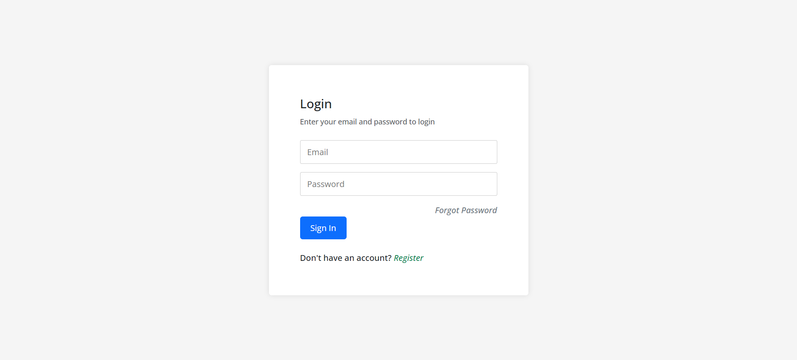
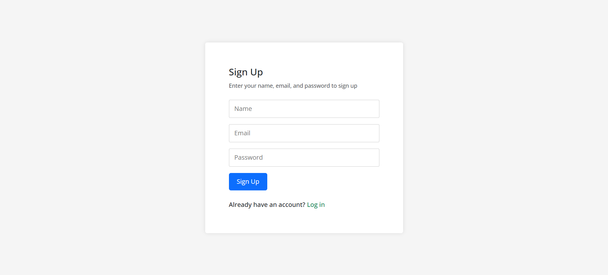
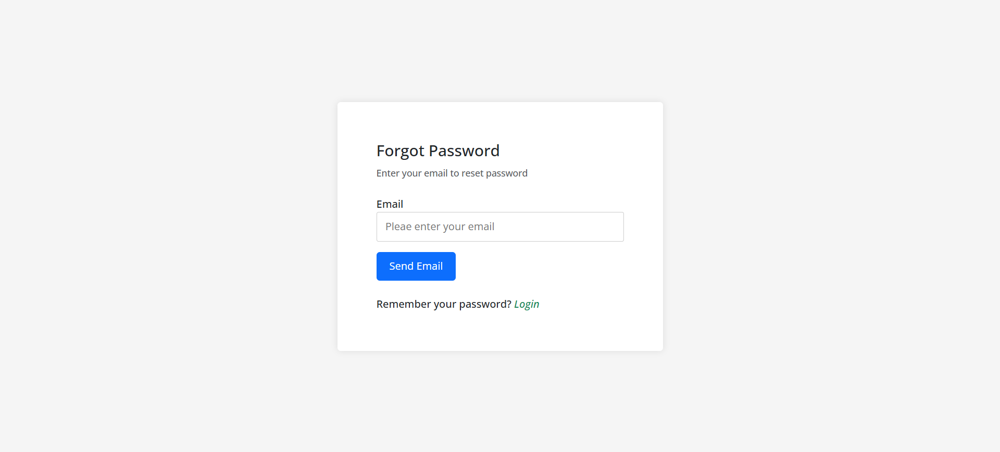
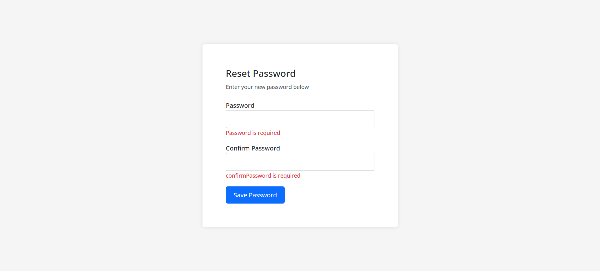
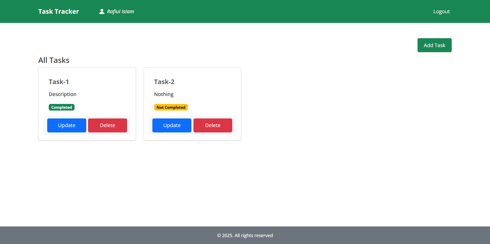
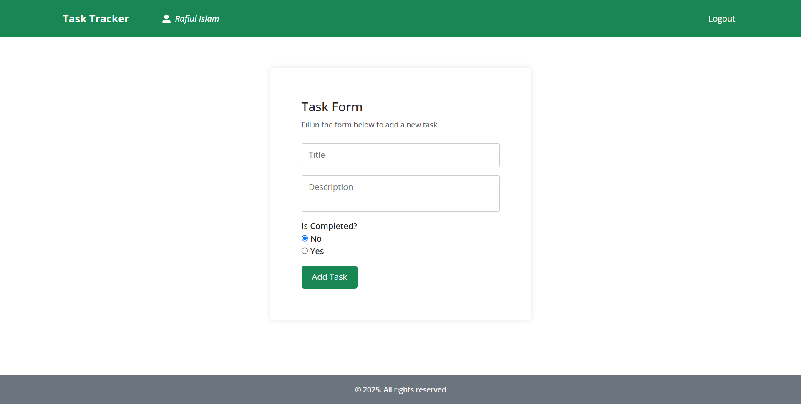
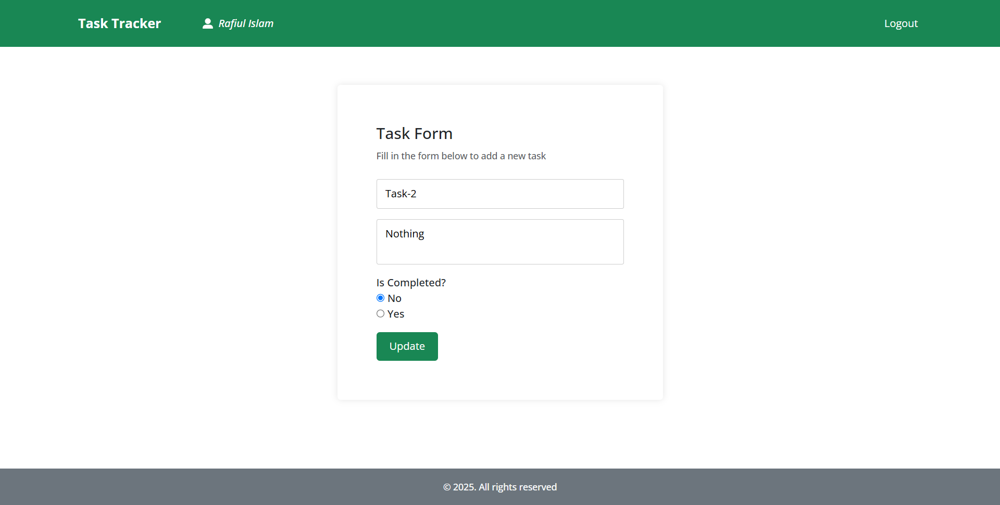

# Task Tracker App

Task Management App is a full stack app, where user can track there tasks. It is build on top of React, Vite, and TypeScript for frontend and Nodejs Express for backend.
## Features

- Users can log in, sign up, and reset their passwords with email verification.
- Form data is validated for login, signup, and password recovery.
- Each user has access only to their own tasks.
- Users can add, update, and delete tasks.

## Technology

- **Frontend:** React, Vite, TypeScript
- **Backend:** Node.js, Express
- **Database:** MongoDB
- **Authentication:** JWT (JSON Web Tokens)
- **State Management:** React Query, Zustand
- **Form Validation:** Zod, React Hook Form
- **Notifications:** React Toastify
- **Email Service:** Gmail

## Screenshots

### Login Page

### Signup Page

### Forgot Password Page

### Reset Password Page

### Tasks Page

### Add Task Page

### Update Task Page

## How to run

1. Clone the repository
2. Go to the `server` folder
3. Create a `.env` file from `.env.example` and add all the required values there
4. Run `npm install` to install dependencies
5. Run `npm run start` to start the server
6. Go to the `client` folder
7. Run `npm install` to install dependencies
8. Run `npm run dev` to start the development server
9. Open [http://localhost:5173](http://localhost:5173) in your browser
## How to build

1. Run `npm run build` to build the app
2. The built app will be in the `dist` folder

## License

This project is licensed under the MIT License. See the [LICENSE](LICENSE) file for details.